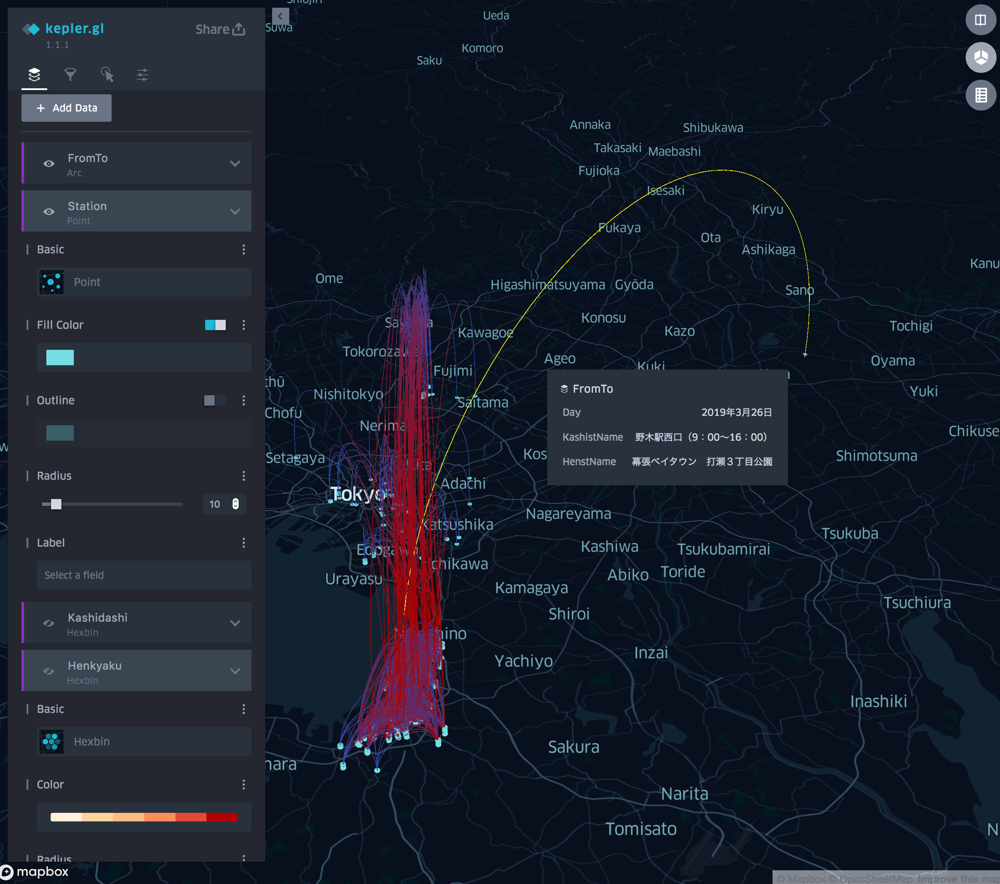
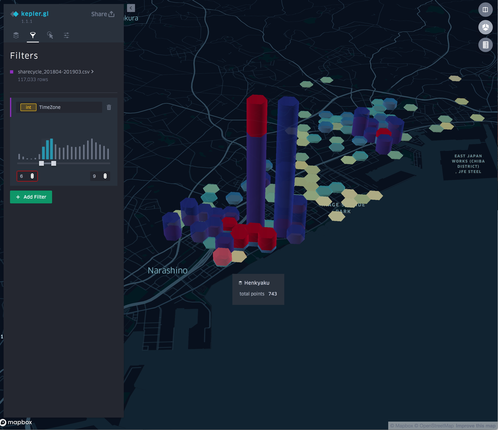
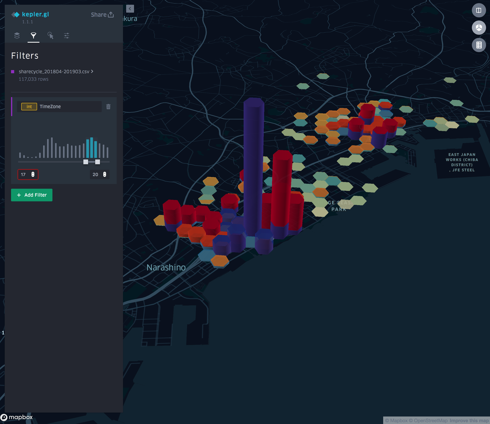

# ChibaShareCycle

[千葉市シェアサイクルオープンデータ](https://www.city.chiba.jp/sogoseisaku/sogoseisaku/tokku/share-cycle_opnedata.html)からダウンロードしたシェアサイクル利用データから，貸出ステーションから返却ステーションの移動状況を [kepler.gl](https://kepler.gl/) で地図上に可視化しました．
 

### sharecycle_201804-201903.csv

シェアサイクル利用データ（2018年4月～2019年3月）（エクセル：9,196KB）をCSVに変換してヘッダーを整理したファイル

### kepler.gl.html

kepler.gl で シェアサイクル利用データのCSVを可視化し，exportしたHTMLファイル

[デモページ](https://tkhrmeme.github.io/ChibaShareCycle/kepler.gl.html)

## 表示例

貸出ステーションから返却ステーションへの移動状況

朝（6〜9時）の貸出（青）と返却（赤）の件数

夜（17〜20時）の貸出（青）と返却（赤）の件数

